# From LLMs to LLM‑based Agents for Software Engineering – Dataset Pack

> Figures, Tables & Supplemental Material for the survey paper
---

## 1  Overview

This repository contains table/image that accompany our survey on the evolution from standalone Large Language Models to LLM‑based Agents in software engineering.

---

## 3  Sub‑topic Artefacts

### 3.1 Keywords

* **Keywords table:** · 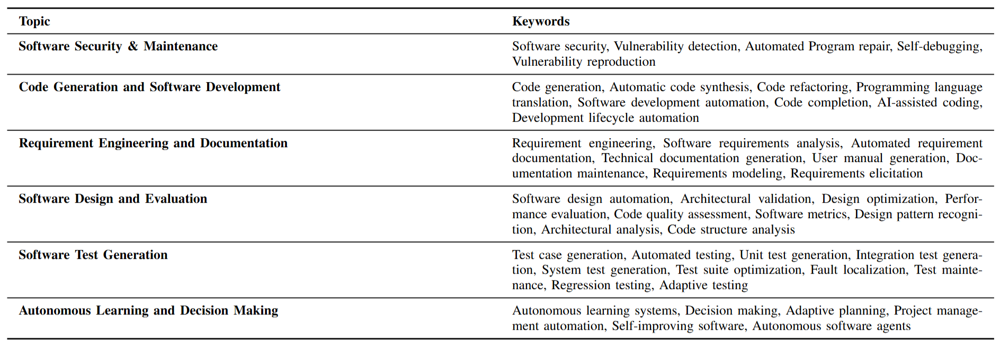

### 3.2 Requirement Engineering & Documentation

* **Benchmark table:** · 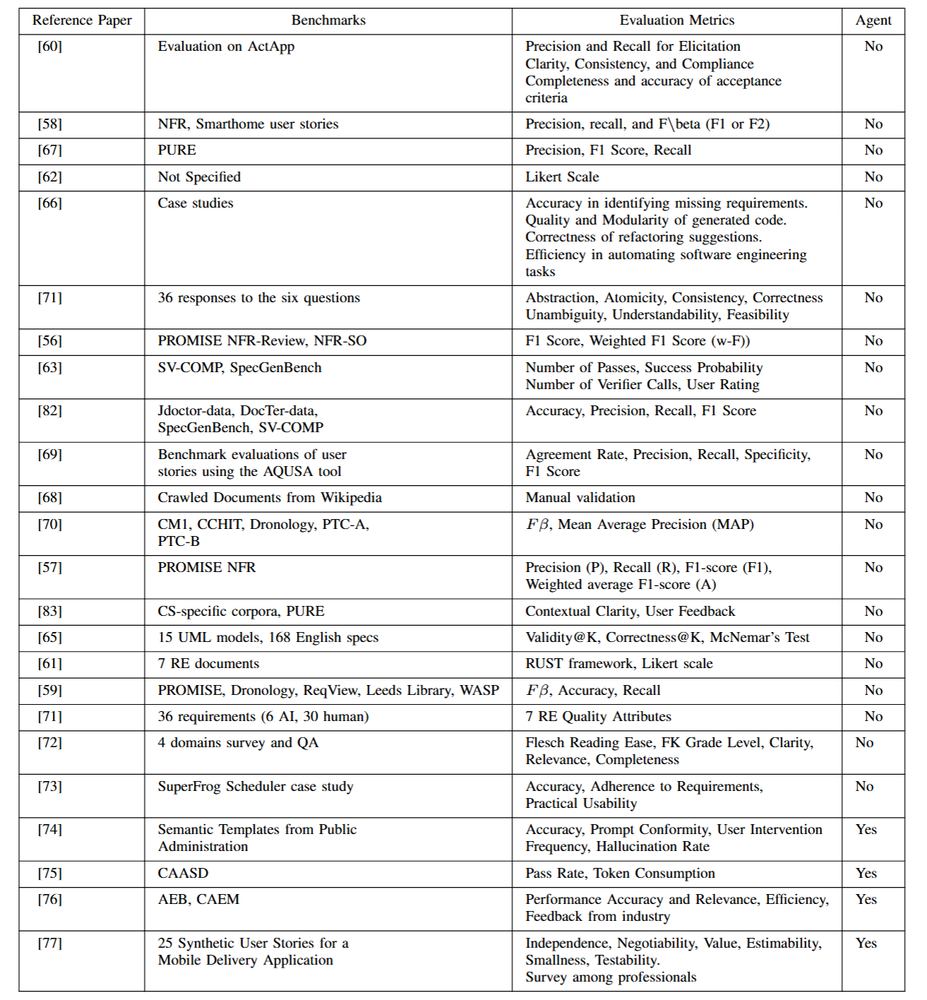

### 3.3 Code Generation & Software Development

* **Benchmark table:** [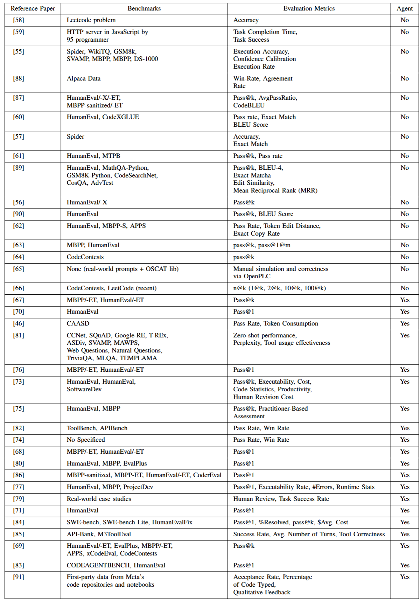

### 3.4 Autonomous Learning & Decision Making

* **Benchmark table:** 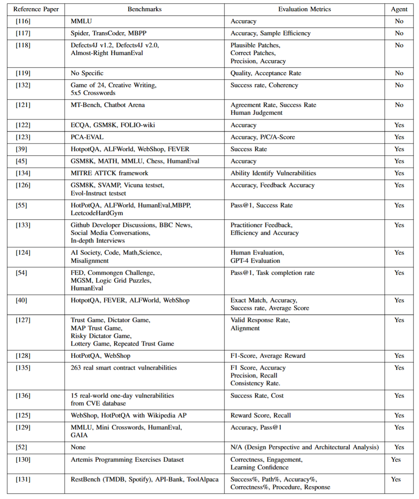

### 3.5 Software Design & Evaluation

* **Benchmark table:** 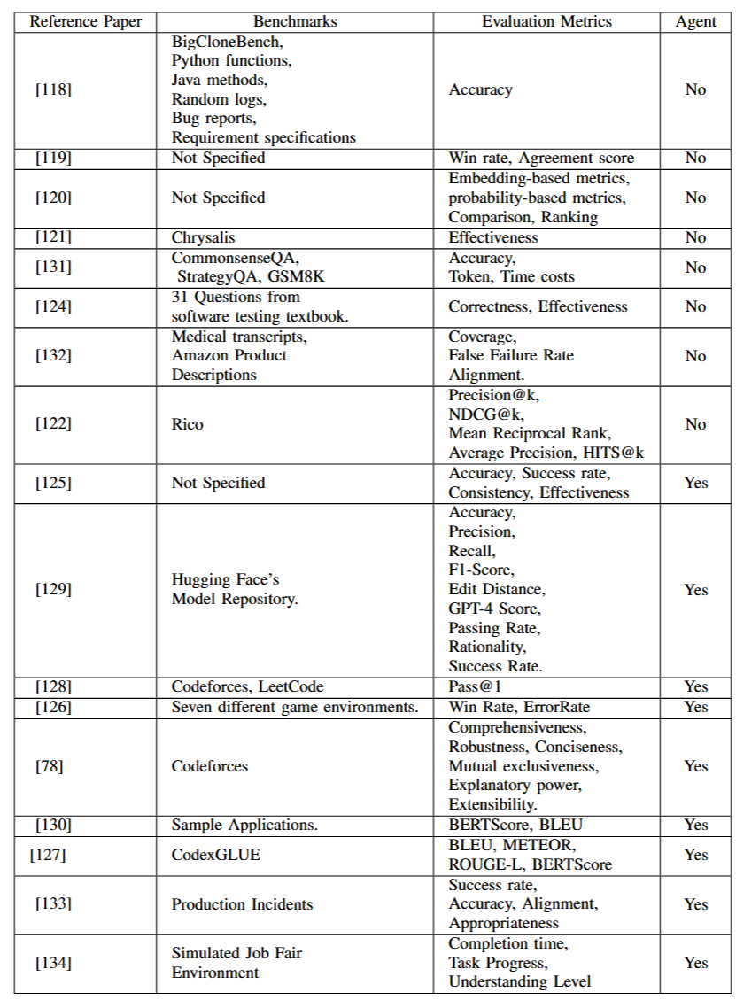

### 3.6 Software Test Generation

* **Benchmark table:** 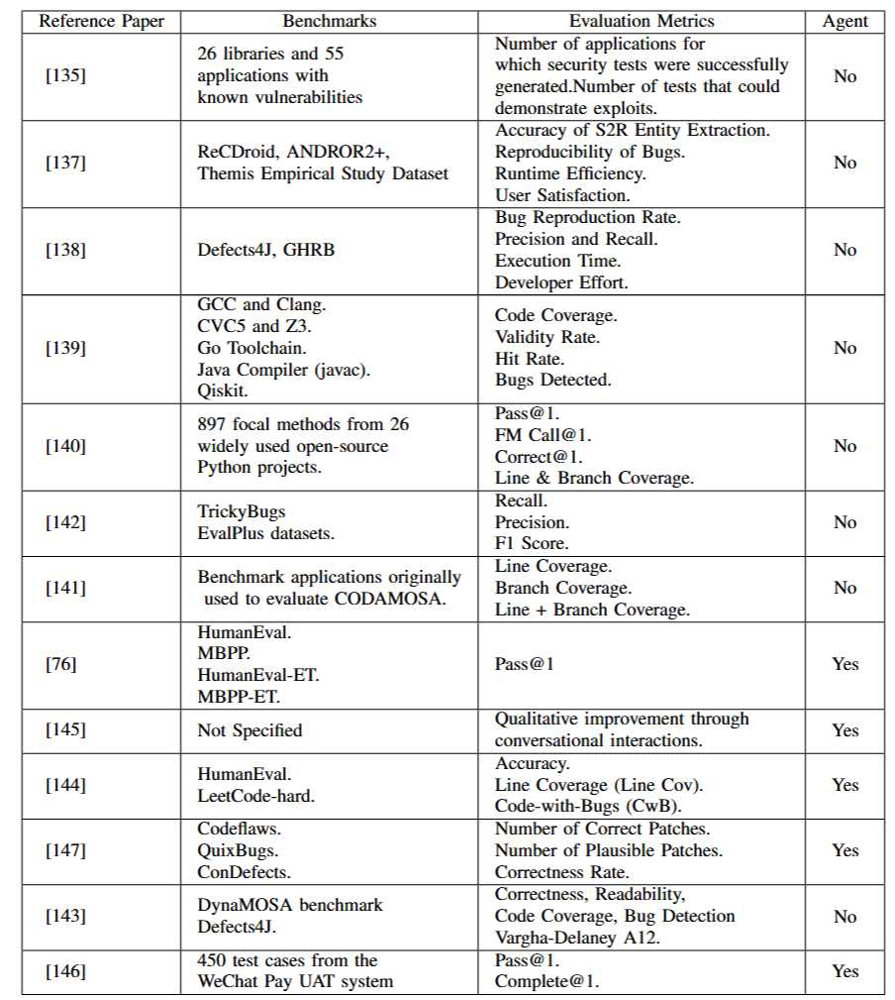

### 3.7 Software Security & Maintenance

* **Benchmark table:** 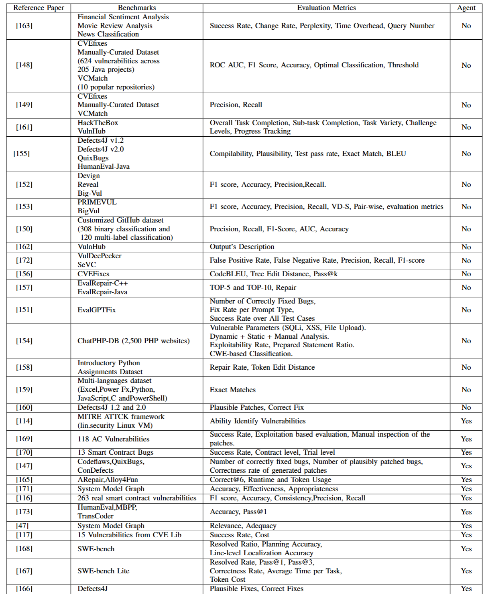

---

## 4  Discussion Figures

### 4.1 DISTRIBUTION OF BENCHMARKS
* **Benchmark Usage Frequency:** 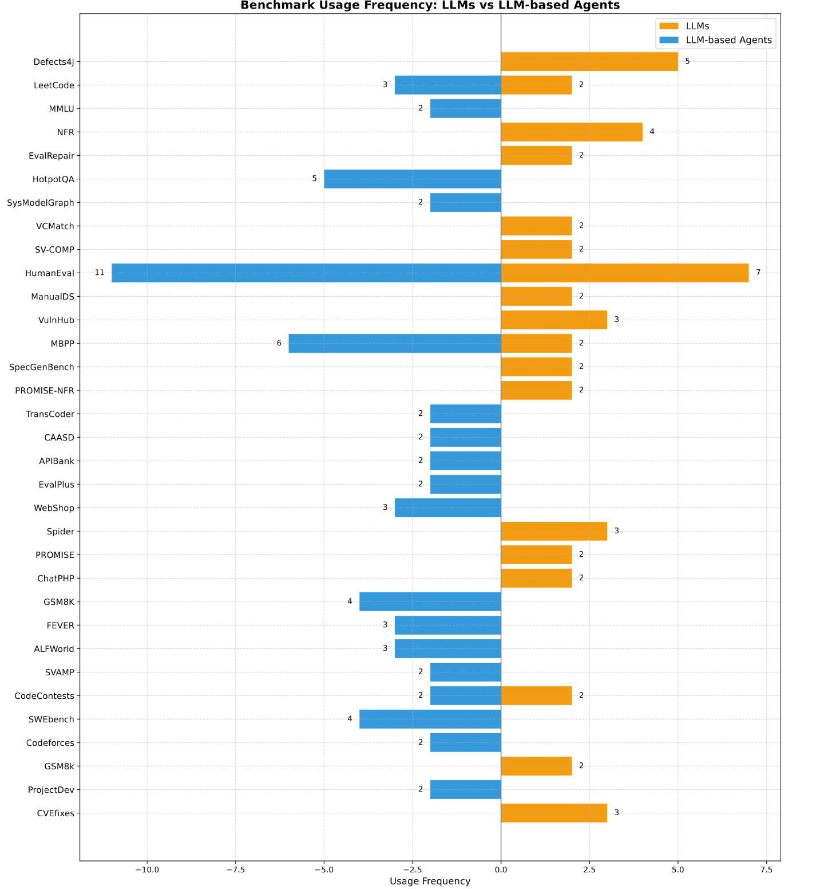
[bench_freq.pdf](https://github.com/user-attachments/files/20430206/bench_freq.pdf)

### 4.2 Requirement Engineering & Documentation

* **LLM vs Agent Comparison:** 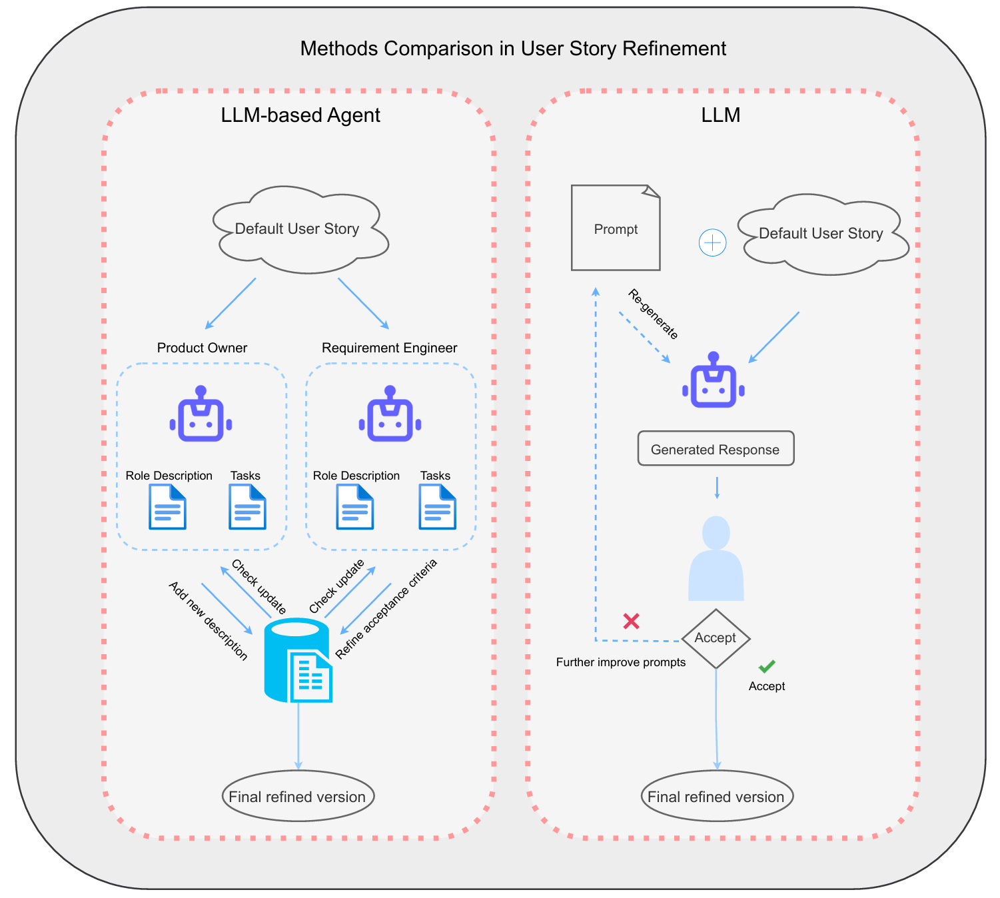
  [req_compare.pdf](figures/req_compare.pdf)

### 4.3 Code Generation & Software Development

* **LLM vs Agent Comparison:** 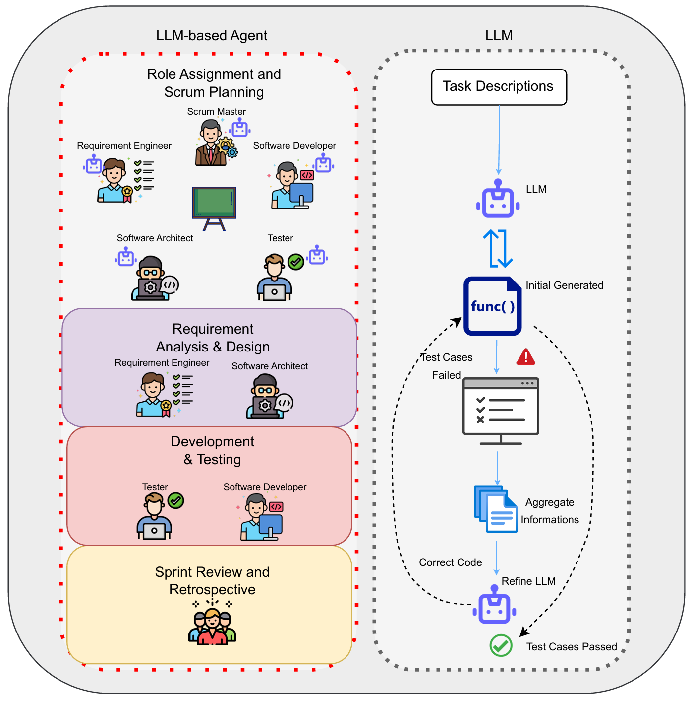
  [code_compare.pdf](figures/code_compare.pdf)

### 4.4 Autonomous Learning & Decision Making

* **LLM vs Agent Comparison:** 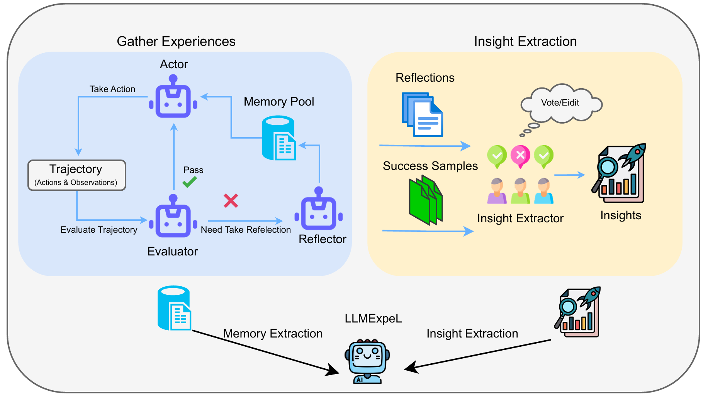
  [auto_compare.pdf](figures/auto_compare.pdf)

### 4.5 Software Test Generation

* **LLM vs Agent Comparison:** 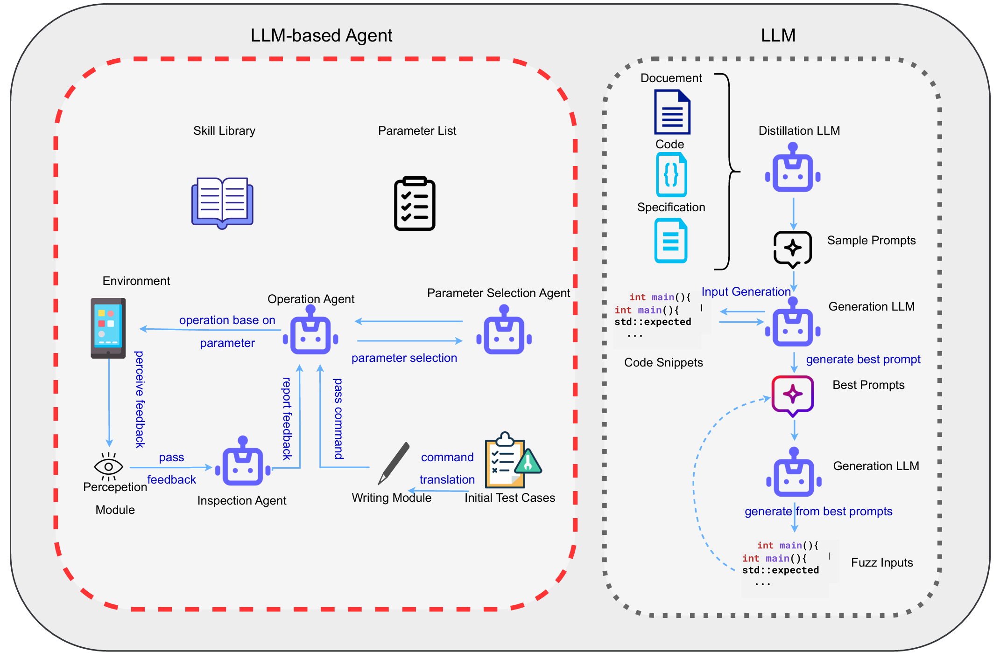
  [test_compare.pdf](figures/test_compare.pdf)

### 4.6 Software Security & Maintenance

* **LLM vs Agent Comparison:** 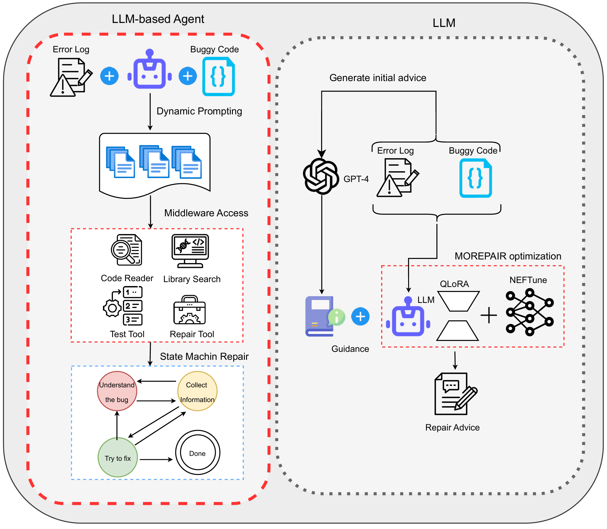
  [main_compare.pdf](figures/main_compare.pdf)
---

## 3  License

* **Dataset (figures & tables):** [CC BY 4.0](https://creativecommons.org/licenses/by/4.0/)
* **Scripts & code:** [MIT License](LICENSE)
---

